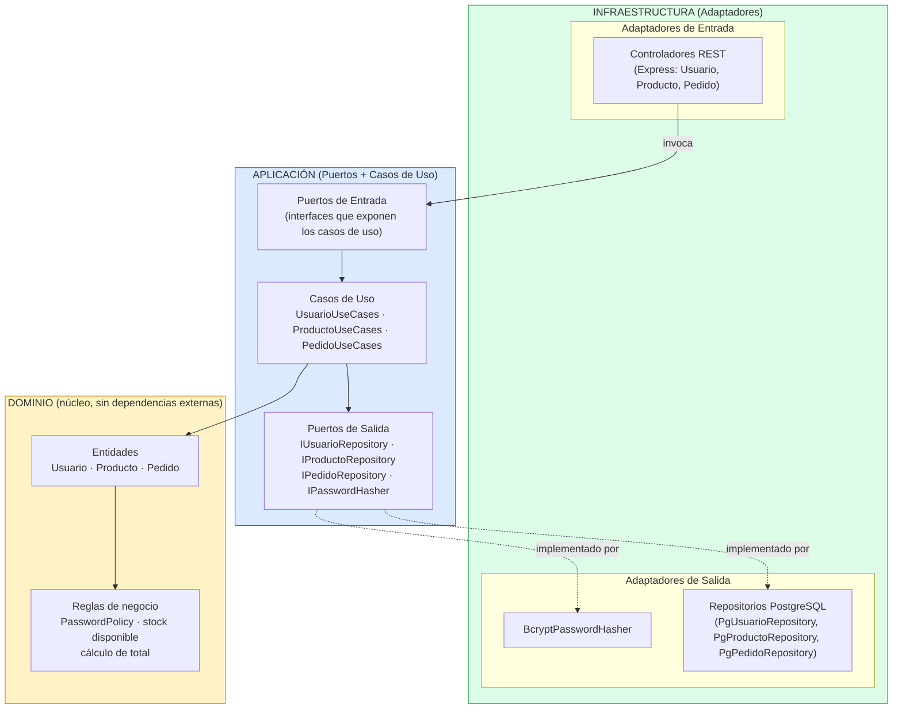
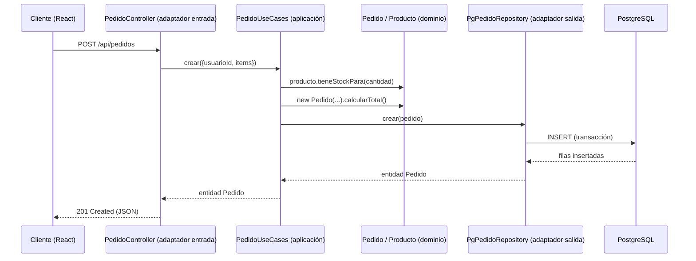

# Diagrama Arquitectónico — Backend Hexagonal

## Vista general de capas



## Regla de dependencia (clave de la Arquitectura Hexagonal)

Las flechas de dependencia SIEMPRE apuntan hacia adentro:

```
Infraestructura  →  Aplicación  →  Dominio
```

- **Dominio** no importa nada de `express`, `pg` ni `bcrypt`. Solo contiene las
  entidades (`Usuario`, `Producto`, `Pedido`) y las reglas de negocio puras
  (validación de contraseña, verificación de stock, cálculo de total).
- **Aplicación** define los **puertos** (interfaces) que necesita para
  funcionar — `IUsuarioRepository`, `IPasswordHasher`, etc. — y los **casos
  de uso** que orquestan al Dominio. No sabe si detrás hay PostgreSQL o
  MongoDB.
- **Infraestructura** contiene los **adaptadores** concretos: de entrada
  (controladores HTTP/Express que traducen peticiones REST en llamadas a
  casos de uso) y de salida (repositorios PostgreSQL, el adaptador
  bcrypt). Es la única capa que conoce el "mundo exterior".

## Flujo de una petición (ejemplo: crear pedido)



## Estructura de carpetas del backend

```
backend/src/
├── domain/
│   ├── entities/        Usuario.js, Producto.js, Pedido.js
│   └── services/         PasswordPolicy.js
├── application/
│   ├── ports/
│   │   ├── input/         (contratos que exponen los casos de uso)
│   │   └── output/        RepositoryPorts.js (contratos de repos/hasher)
│   └── usecases/           UsuarioUseCases.js, ProductoUseCases.js, PedidoUseCases.js
└── infrastructure/
    ├── adapters/
    │   ├── input/http/
    │   │   ├── controllers/  UsuarioController.js, ProductoController.js, PedidoController.js
    │   │   └── routes/       usuarioRoutes.js, productoRoutes.js, pedidoRoutes.js
    │   └── output/
    │       ├── postgres/     PgUsuarioRepository.js, PgProductoRepository.js, PgPedidoRepository.js
    │       └── security/     BcryptPasswordHasher.js
    └── config/               db.js, container.js, app.js
```
